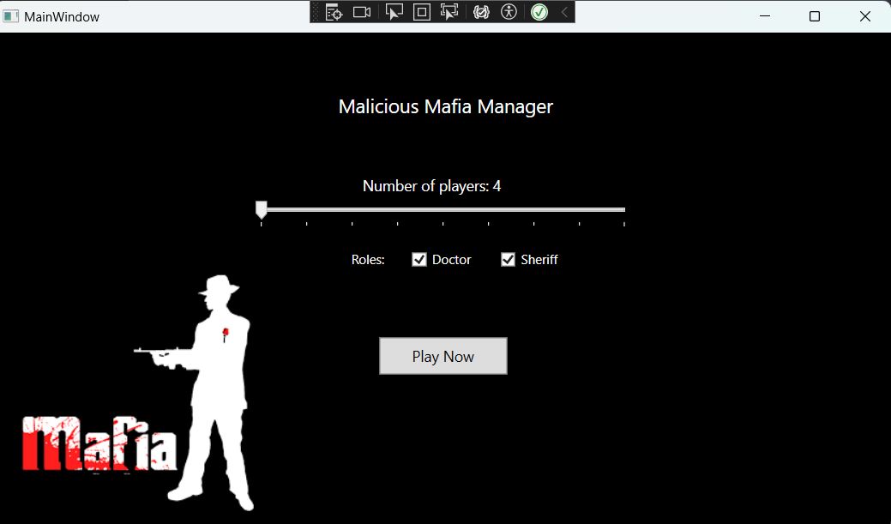
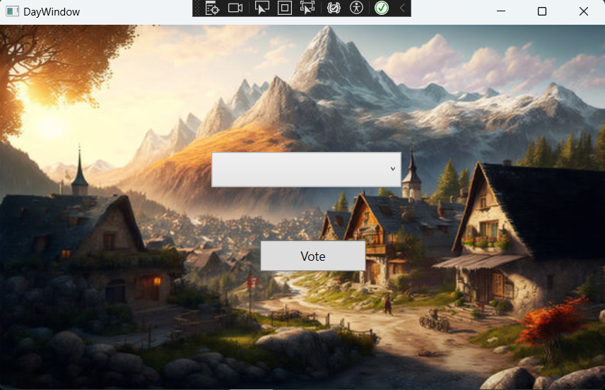
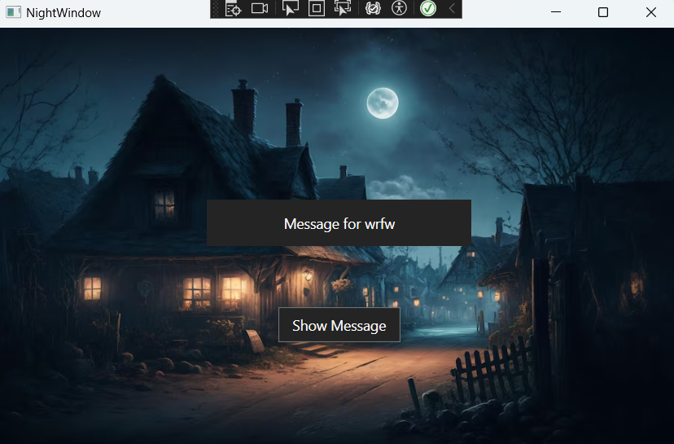
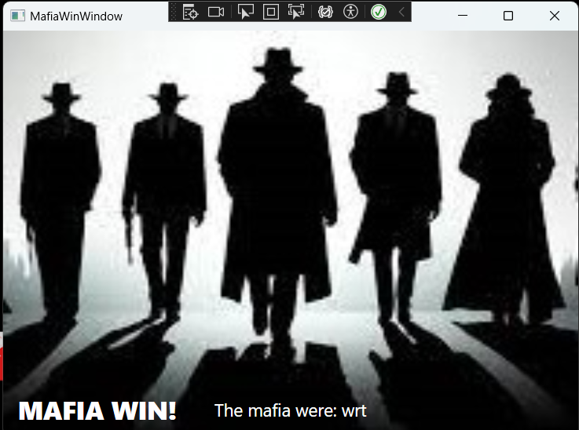
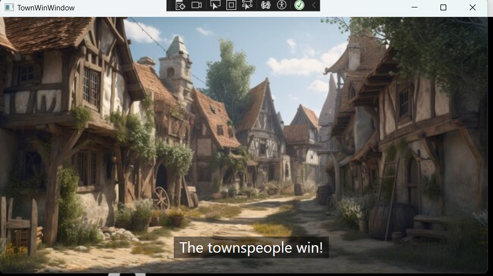
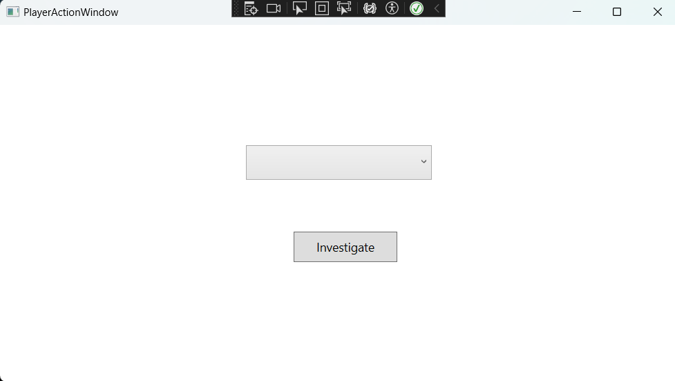
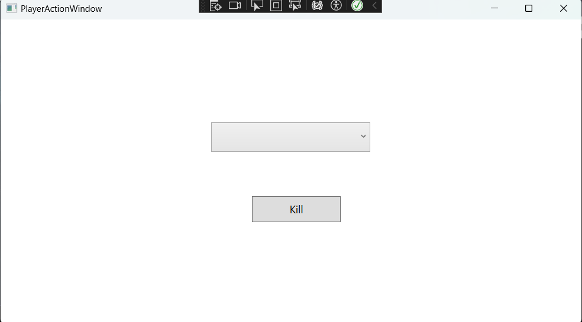

# Mafia Manager Game

## Project Overview

Mafia Manager is a desktop-based game developed using C# and .NET Framework 8, crafted with Visual Studio 2022. The game brings the classic Mafia gameplay experience to the digital realm, where players take on different roles within a town setting, aiming to fulfill their roles' objectives amidst the intrigue of day and night cycles. The project emphasizes a rich graphical interface, seamless music integration, and dynamic frame transitions to enhance the gaming experience.

### Team Contribution

Developed by a team of four, contributions spanned across various facets of the game, with specific focus on graphics, music implementation, and the timing of frame openings to ensure a fluid and engaging user experience.

## Features

### Main Window

This is the main Window where you get to choose how many players should involve in the game  and also if there should be a Doctor and a Sheriff role 

### Day Window

The Day Window is where the townspeople (players) deliberate and vote on who they suspect to be part of the Mafia. It features a voting mechanism, background music to set the day's mood, and speech synthesis to narrate the events of the day. This window is crucial for progressing the game's storyline, with players' decisions directly affecting the game's outcome.

### Night Window

During the Night Window, the Mafia selects a target to eliminate, while other roles such as the Doctor and Sheriff perform their actions in secret. This window utilizes sound effects and music to create a suspenseful atmosphere, reflecting the tension and uncertainty of the night phase in Mafia gameplay.

### Win and Lose Windows

The game concludes with either the MafiaWinWindow or the TownWinWindow, depending on which faction achieves their objective first. These windows announce the game's outcome, displaying the winning side and providing a recap of the pivotal decisions and events that led to this conclusion.

### Investigation and Vote Window

Special roles like the Sheriff use the Investigation Window to uncover the Mafia, while the Day Window serves as the primary interface for voting decisions. These components are integral to the strategic depth of Mafia Manager, allowing for intricate player interactions and decision-making.

## Getting Started

### Prerequisites

* Windows OS
* .NET Framework 8
* Visual Studio 2022

### Installation

1. Clone the repository to your local machine.
2. Open the solution file in Visual Studio 2022.
3. Ensure all dependencies are correctly restored by Visual Studio.
4. Build the solution to compile the game.
5. Run the application to start playing Mafia Manager.

## Usage

After launching the game, players can create a new game session, select the number of players, and assign roles either manually or automatically. The game progresses through day and night cycles, with each role performing their actions during the appropriate phase. Players must use strategy, deduction, and teamwork to achieve their faction's goals.
